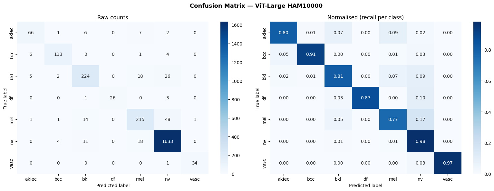

# Skin Cancer Classification using ViT-Large

Fine-tuned Google's Vision Transformer (ViT-Large) on the HAM10000 dataset to classify 7 types of skin lesions. Trained entirely on a free Google Colab T4 GPU in about 37 minutes.

**Live model → [huggingface.co/Kuldeepmishra3/vit-large-skin-cancer-ham10000](https://huggingface.co/Kuldeepmishra3/vit-large-skin-cancer-ham10000)**

---

## Results

| Metric | Score |
|--------|-------|
| Accuracy | 92.74% |
| Weighted F1 | 92.60% |
| Training time | 37 minutes |
| GPU | Tesla T4 (free Colab) |

Per-class breakdown:

| Class | F1 Score |
|-------|----------|
| Vascular Lesions | 97.14% |
| Melanocytic Nevi | 96.54% |
| Dermatofibroma | 92.86% |
| Basal Cell Carcinoma | 92.24% |
| Actinic Keratoses | 82.50% |
| Benign Keratosis | 84.37% |
| Melanoma | 79.78% |

Melanoma was the hardest class — it often gets confused with Melanocytic Nevi, which is a known challenge even in clinical dermatology.

---

## Dataset

**HAM10000** — Human Against Machine with 10000 training images

- 10,015 dermoscopy images across 7 classes
- Heavy class imbalance (Melanocytic Nevi makes up ~67% of data)
- Images collected from different populations and acquired with different equipment

Source: [marmal88/skin_cancer on HuggingFace](https://huggingface.co/datasets/marmal88/skin_cancer)

---

## Model

Base model: `google/vit-large-patch16-224`

- 303M parameters, all fine-tuned (full fine-tuning, not LoRA)
- Input: 224x224 RGB dermoscopy images
- Output: probability distribution over 7 skin lesion classes
- The ImageNet classification head (1000 classes) was replaced with a fresh 7-class head

---

## Training setup

```
Epochs:             5
Batch size:         16
Learning rate:      2e-5 (cosine schedule)
Warmup steps:       300
Weight decay:       0.01
Precision:          FP16 (mixed precision)
Best epoch:         4 (by weighted F1)
```

**Augmentations used during training:**
- Random horizontal + vertical flip
- Random rotation (±30°)
- Color jitter (brightness, contrast, saturation, hue)

No augmentation during validation — just resize and normalize.

---

## Training curves

Loss dropped from 1.6 → ~0.003 over 5 epochs. Accuracy and F1 both improved steadily without overfitting.




---

## How to use

```python
from transformers import pipeline

classifier = pipeline(
    "image-classification",
    model="Kuldeepmishra3/vit-large-skin-cancer-ham10000",
)

# Pass any PIL image or image path
results = classifier("your_skin_image.jpg", top_k=3)
for r in results:
    print(f"{r['label']}: {r['score']:.2%}")
```

---

## Run it yourself

Everything runs on free Google Colab — no paid GPU needed.

1. Open `ViT_Large_Medical_FineTuning.ipynb` in Colab
2. Set runtime to T4 GPU
3. Run all cells top to bottom
4. Total time: ~45 minutes including dataset download

---

## What I learned

A few things that weren't obvious going in:

- The class imbalance in HAM10000 is severe — nv has 60x more samples than df. Color jitter and flipping help but the model still struggles most with melanoma vs nevi confusion, which makes sense given how visually similar they can be.
- FP16 mixed precision made a big difference — cut VRAM usage enough to fit batch size 16 on T4 without OOM errors.
- ViT-Large converges fast on medical images. Epoch 4 was already the best — epoch 5 didn't improve much, suggesting 3-4 epochs is the sweet spot for this dataset size.

---

## Repo structure

```
├── ViT_Large_Medical_FineTuning.ipynb   # Full training notebook
├── training_curves.png                  # Loss, accuracy, F1 plots
├── confusion_matrix.png                 # Per-class confusion matrix
└── README.md
```

---

## References

- [An Image is Worth 16x16 Words (ViT paper)](https://arxiv.org/abs/2010.11929)
- [HAM10000 Dataset paper](https://www.nature.com/articles/sdata2018161)
- [HuggingFace Transformers](https://huggingface.co/docs/transformers)
